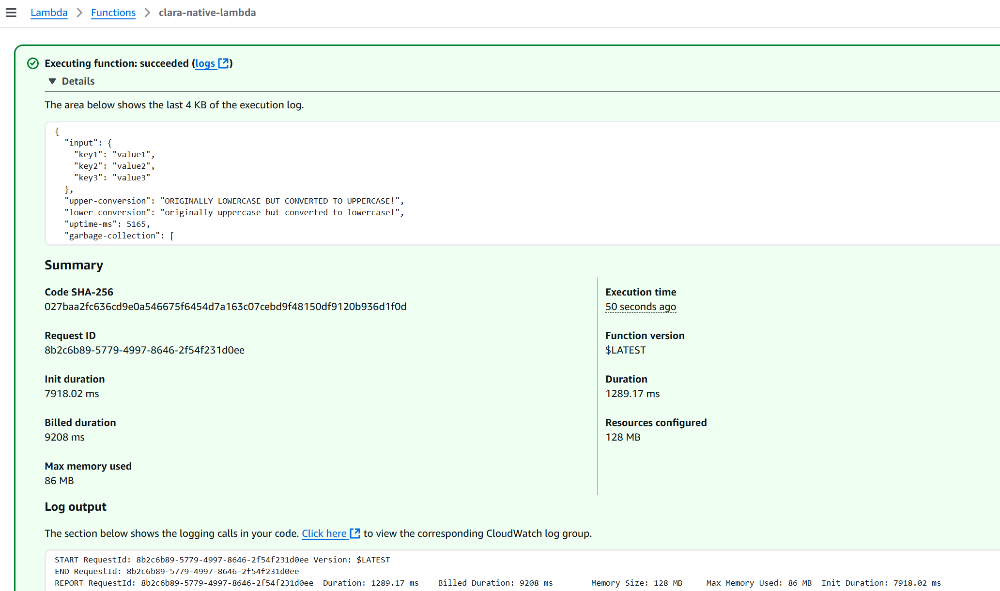
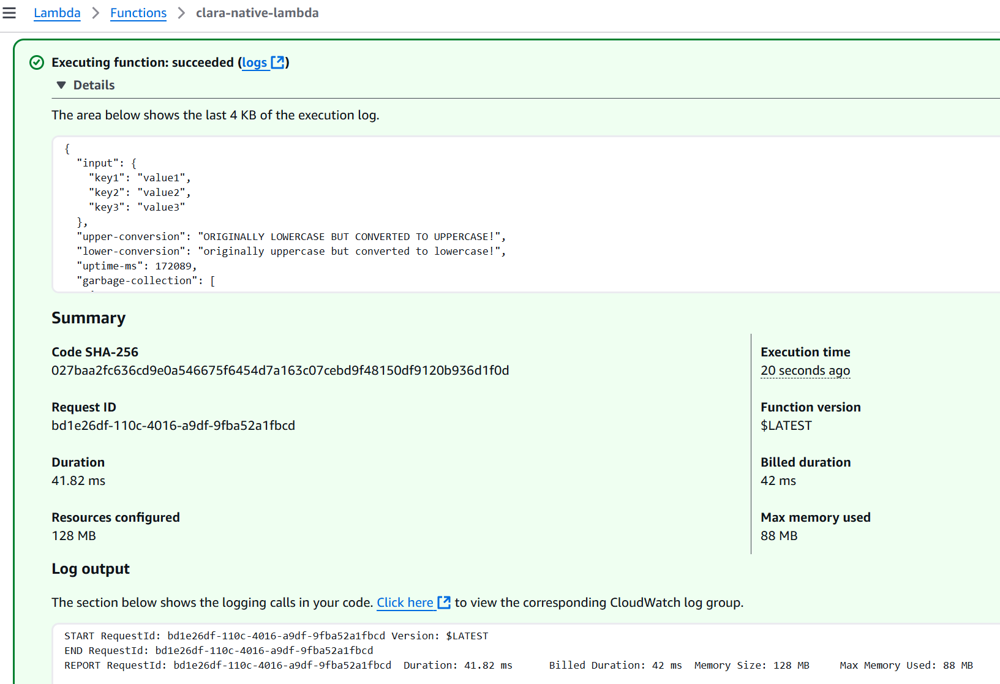
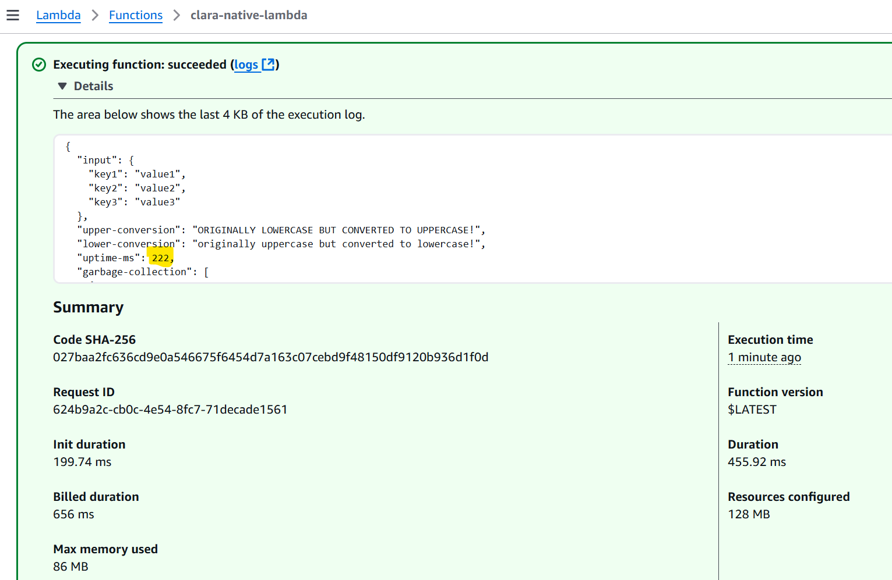

# Background, performance, etc

## First call
The first call to the lambda is slow, as AWS provisions the server

## Second call
The second call is  much faster with no cold starts

## Later calls
Later calls are still fast even when the application is restarted - see the low uptime
